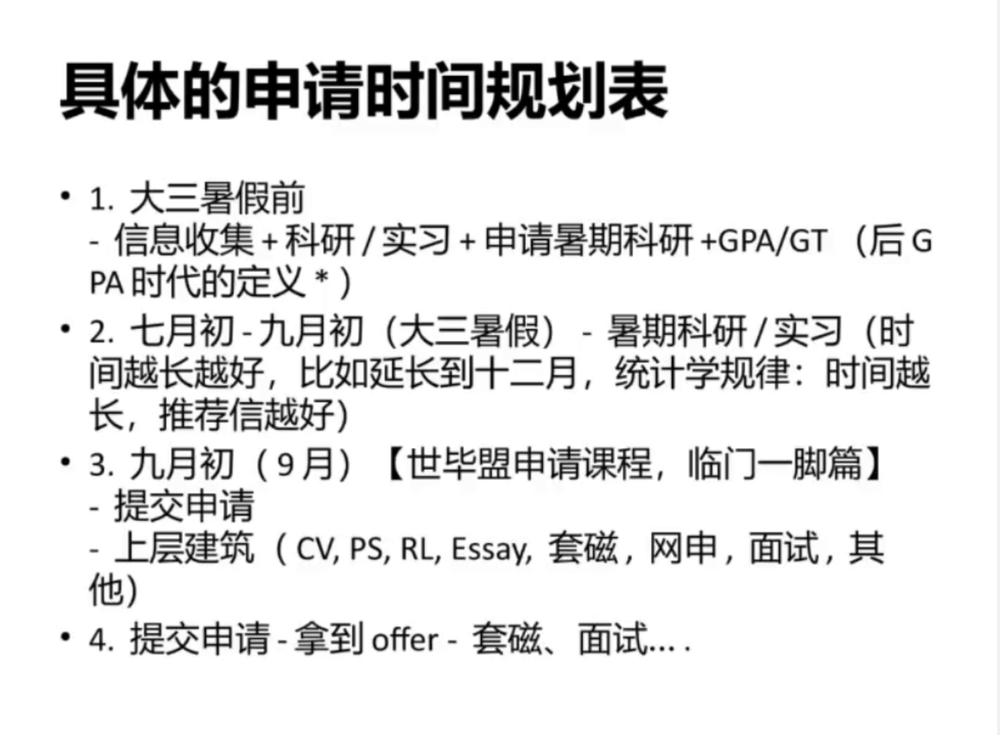

+++
title = '申请培训课'
date = 2024-09-07T09:08:03+08:00
draft = false
+++

## 大纲

- 3月课 - 背景提升
- 申请临门一脚总论
- 套磁 + 面试
- 选校选专业
- 推荐人策划和强推打造
- 各种申请文书应对和策划（怎么写初稿）
- 申请程序 + 避坑指南

## 申请临门一脚总论

- GRE越来越不重要，可以不要考
- 9.10 教师节，是要推荐信的契机（问问海强和院长）
- 只做最重要的事，其他的不做。很多人到申请最后都在走弯路
- 宏观战略（工作导向）：
  - 满足前提条件（托福小分等硬性要求）
  - 积累相关经历（实习、科研、课外活动）
- 各因素重要性
  - 科研导向：牛推荐信=好paper>科研>=GPA>GRE&TOEFL>课外活动
  - 工作导向：都很重要
- 简历扬长避短，长的放前面
- 心态：谦虚+自信
  - 谦虚：没有任何一个项目100%上
  - 自信：所有牛校都要大胆尝试，不留遗憾

Master提交时间：12.1 - 2.15；出结果时间：2.15 - 3.31

round制不要去抢第一轮，不是越早越好，准备充分再申，第一批还要考虑留位费。建议“毕其功于一役”，一次性提交15个项目

面试：不是拿到面试时才开始准备，而是写文书的时候就准备好，到时候只是不断排练。所以现在就要开始准备！

WES要做一个，给学校发邮箱，说我是帮你审理材料。

## 套磁 + 面试

### 套磁

目标院校教授的交流、跟小秘的沟通

套磁校友（所有项目都适用），有的项目直接说明非网申的一切材料都不会被审阅，但事实并不是这样。求人帮忙，一定要让对方知道怎么帮你（校友的推荐信自己写好给他，让他直接发；不要因为他不知道怎么写而拒绝你）

CMU金工学姐，“回馈项目，有个学妹怎么怎么好，....，对其非常了解”，所以去LinkedIn上找校友。招生官信自己相信的人。不要泛滥，自己想去的才去布局。要让校友真正了解你。

申请其他核心工作尚未完成，先做其他的，不要套磁。没事干了再套磁，这和拜菩萨一样。

### 感谢信：当天发出

1. 客气
2. 纠正错误（没答上的
3. 表示非常想来

你有什么问题问我们？官网上的内容不要问

不要暴露弱点，至死不渝的想来，不要流露出犹豫和权衡

工作导向硕士：（招生组/校友）

你是怎么找到这段实习的？（家里人找的不能说）

会很关注海外经历（交换经历）

讲好故事，自圆其说。段子和素材都要平时想好（比如非常detail oriented...）。不懂得话再看一遍蜘蛛侠，他们要什么样的故事。

为什么选择这个项目
- 头部公司
- 选课的自由度（商学院、理学院）
- 校友的广泛程度、紧密程度
- 频繁的活动（请校友会来讲座）
- 与企业的合作
- 甚至可以直接说哪个教授名字，开了什么课...（单独做功课）

（补充...）

严禁说对每个学校都适用的，要具体，有针对性。不要说“因为在纽约好就业”

视频面试有题库，提前准备

先修课不是非常严格的执行，不要因为没达到而惧怕申请，这是弹性的

**面试的十大注意事项**

（ppt）

## 选校选专业

一个学校是否可以申多个？要了解学校组织架构，部门之间有没有管辖关系，决定能不能同时申请。比如加州理工就难在只能申一个项目。

## 推荐人策划和强推打造

1. 提交的IP地址
2. 不要个性化抬头：to whom it may concern
3. 4种推荐人及策略
   1. 完全放权
   2. 检查推荐信内容，其他放权（3-4最高分，其他一般分）
   3. 要草稿，但自己独立提交
   4. 完全独立完成全部内容

教师节的问候

## 申请程序 + 避坑指南

文书

- CV/Resume
- RL (Recommendation Letter)
- PS
- PHS (Personal History Statement)

同一件事情，在不同地方（CV，RL，PS）做不同的陈述，角度不一样，说明这件事是真的。

## 推荐信写作

[推荐信](ppt/10%20推荐信的布局和策划.pptx)

- 称呼：To Whom It May Concern,
- 首段：
  - 自我介绍
  - 和申请者的关系，认识时间和原因
  - 对申请人定量的评价

> I would say that XXX ranks Top 1% in all undergraduate students that I supervised in these 10 years. 

- 中间段 （论点+论据）
- 结尾段

打分，3-4个次高分，其他最高分

一定要放弃看推荐信的权利！！否则推荐人会看在你的面子上对你的客观评价有所保留，这封推荐信的效力就大大降低了

## 文书的种类概述

[文书](ppt/11%20各种申请文书的应对和策划.pptx)

- CV/Resume：客观自己陈述经历，证明自己胜任项目；
- RL(Reference Letter)：专家主客观评价，证明申请者胜任项目；
- PS (Personal Statement), Statement of Purpose (SOP)：主客观论证，说服委员会给offer；

三位一体，一段重要经历在这三个材料上都要出现

