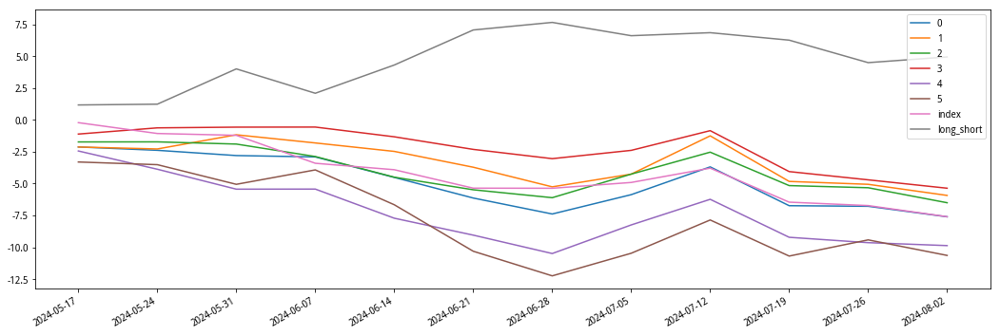

+++
title = '基于JoinQuant的因子回测框架'
date = 2024-08-25T12:07:27+08:00
tags = ['量化']
draft = false
math = true
+++

```python
from jqfactor import get_factor_values, neutralize, winsorize_med, standardlize
from jqfactor import Factor, calc_factors

import datetime
import pandas as pd
import numpy as np
import matplotlib.pyplot as plt
import statsmodels.api as sm
from scipy.stats import spearmanr,pearsonr
import matplotlib.pyplot as plt
import matplotlib.dates as mdates
import copy
import time

plt.rcParams['font.sans-serif'] = ['SimHei'] # 用来正常显示中文标签
plt.rcParams['axes.unicode_minus'] = False # 用来正常显示负号
```

# 获取数据

## 获取交易日

输入：start_date（起始日期），end_date（终止日期），freq（频率），count（None）

```python
# 1.1-获取交易日
def get_calendar(start_date=None, end_date=None, freq='D', count=None):
    """
    params:
    start_date(Timestamp)：起始日期，年月日
    end_date(Timestamp)：终止日期，年月日
    freq(str)：交易日频率，默认每天
     - 'W': 每周
     - 'M': 每月
     - 'Q': 每季度
     - 'Y': 每年
    count(int)：获取终止日期前交易日数量
    
    return:
    df.index(DatetimeIndex)：交易日索引列表
    """
    # 调整时间格式
    start = pd.to_datetime(start_date)
    end = pd.to_datetime(end_date)
    
    # 时间区间
    if count != None:
        df = get_price('000001.XSHG', end_date=end, count=count)
    else:
        df = get_price('000001.XSHG', start_date=start, end_date=end)
    
    # 时间周期
    end_day = df.index
    df[freq] = df.index.to_period(freq).start_time
    end_day = df.groupby(freq).apply(lambda x: x.index.max())
        
    return pd.to_datetime(end_day.values)
```

```python
# 例子
start = "20230101"
end = "20231231"
get_calendar(start, end, freq='M')
```

输出

```
DatetimeIndex(['2023-01-31', '2023-02-28', '2023-03-31', '2023-04-28',
               '2023-05-31', '2023-06-30', '2023-07-31', '2023-08-31',
               '2023-09-28', '2023-10-31', '2023-11-30', '2023-12-29'],
              dtype='datetime64[ns]', freq=None)
```

## 筛选股票函数

剔除

- ST股
- 次新股
- 开盘涨跌停股（可选）

```python
# 1.2-筛选股票函数
def filter_stock(stock_list, date, days=21*3, limit=1):
    """
    params:
    stock_list (list)：股票序列列表，["600000.XSHG", ...]
    date (Timestamp)：交易日，年月日
    days (int)：过滤次新股时间
    limit (int)：过滤涨跌停开关，1/0
    
    return:
    stock_list (list)：过滤后的股票序列列表，["600000.XSHG", ...]
    """
    date = pd.to_datetime(date)
    
    # 除上市距beginDate不足3个月的股票
    def _delete_new(stocks, begin_date, n=days):
        filtered_list = []
        for stock in stocks:
            start_date = get_security_info(stock).start_date
            if start_date < (begin_date - pd.Timedelta(days=n)).date():
                filtered_list.append(stock)
        return filtered_list
    
    # 剔除ST股
    st_data = get_extras('is_st', stock_list, count=1, end_date=date)
    stock_list = [stock for stock in stock_list if not st_data[stock][0]]
    
    # 剔除次新股
    stock_list = _delete_new(stock_list, date, n=days)

    # 剔除开盘涨停股票
    if limit == 1:
        df = get_price(stock_list, end_date=date, fields=['open', 'high_limit', 'low_limit'], 
                       count=1, skip_paused=True, panel=False)
        df = df.set_index("code")
        df['h_limit'] = (df['open'] != df['high_limit'])
        df['l_limit'] = (df['open'] != df['low_limit'])
        # 过滤开盘涨跌停股票
        stock_list = [i for i in df.index if (df.loc[i, "h_limit"] and df.loc[i, "l_limit"])]

    return stock_list
```

```python
# 例子
stockList = list(map(normalize_code, ["301136", "000586", "300125"]))

# 301136为2022-01-11上市
print("剔除次新股：", filter_stock(stockList, "20220102"))

# 300125在2024-06-10为ST股
print("剔除ST股：", filter_stock(stockList, "20240610"))

# 000586在2024-08-07开盘涨停
print("剔除开盘涨跌停股：", filter_stock(stockList, "20240807"))
```

输出

```
剔除次新股： ['000586.XSHE', '300125.XSHE']
剔除ST股： ['301136.XSHE', '000586.XSHE']
剔除开盘涨跌停股： ['301136.XSHE']
```

## 获取因子值函数

joinquant中有两类因子：因子库、定义因子

文档：

- [因子库](https://www.joinquant.com/help/api/help#name:factor_values)
- [定义因子](https://www.joinquant.com/help/api/help#factor:%E5%9B%A0%E5%AD%90%E5%88%86%E6%9E%90API)

其中因子库为joinquant内置，输入字符串即可获取。定义因子是继承Factor类后自己定义的因子，本质上是一个子类。

```python
# 1.3-获取因子值函数，必须全部为聚宽因子或全部为定义因子
# 可以分别获取后再合并
def get_factor_df(stock_list, factor_list, date):
    """
    params:
    stock_list(list)：股票序列列表，["600000.XSHG",...]
    factor_list(list)：因子名称列表，["residual_volatility",...]
    date(Timestamp)：交易日，年月日（取前一日的因子值）
    
    return:
    df(DataFrame)：因子数据集，pd.DataFrame(index=[stock_list], columns=[factor_list])
    """
    date = pd.to_datetime(date)
    
    # 取前一天的数据
    last_date = get_near_trade_day(date, -1)
    
    if type(factor_list[0]) == str:
        factor_data = get_factor_values(securities=stock_list, factors=factor_list, 
                                        end_date=last_date, count=1)
    # 如果是定义因子像ep()这种，需要因子计算
    else:
        factor_data = calc_factors(securities=stock_list, factors=factor_list, start_date=last_date, 
                                   end_date=last_date, use_real_price=False, skip_paused=True)
        factor_list = [factor.name for factor in factor_list]
        
    df = pd.concat([pd.DataFrame(factor_data[f]).T for f in factor_list], axis=1)
    df.columns = factor_list
    
    return df
```

```python
# 例子
stock_list = list(map(normalize_code, ["301136", "000586", "300125"]))
factor_list = ["beta", "size", "momentum"]
get_factor_df(stock_list, factor_list, "20240701")
```

输出

|	code |beta|	size|	momentum|
|:--:|:--:|:--:|:--:|			
|301136.XSHE|	2.435321|	-2.257106|	-1.057598|
|000586.XSHE|	2.069847|	-2.969061|	-1.214831|
|300125.XSHE	|2.515297	|-4.036516	|-3.761750|

## 获取每期股票对应的因子值和收益率

输入日期，因子，以及股票池；对每天的因子值进行去极值（winsorize）、行业市值中性化（neutralize）、标准化（standardlize），至此因子预处理完成。

接着考虑下期收益率。不存在滞后算子时（lag=0）

$$
R_t=\frac{P_{t+1}}{P_t}
$$

若引入滞后算子$i\neq 0$，则

$$
R_t^i=\frac{P_{t+1+i}}{P_t}
$$

所以如果时间序列为 $t_1,t_2,t_3,t_4,t_5$，则lag=0时收益率数据只有四个$R_1,R_2,R_3,R_4$，lag=1时只有三个$R_1^1,R_2^1,R_3^1$，以此类推。

```python
(len(date_list) - 1) - i - 1 < lag_i
```

左式为结束日期到当前日期的距离，右式为收益率跨度

验证：当lag_i = 0时，到最后一个时间点，即 `i=(len(date_list)-1)-1`，此时0<0=False，存在即期收益率，正确。

```python
# 1.4-获取每期股票对应的因子值和收益率
def get_fac_ret_dict(date_list, factor_list, index_code=None, lag_num=5):
    """
    params:
    date_list (list)：交易日列表
    factor_list (list)：因子名称列表，如 ["residual_volatility", ...]
    index_code (str)：指数代码，表示股票池，None 表示全市场池
    lag_num (int)：收益率延期期数，方便后续计算因子 IC 半衰期
    
    return:
    dict：因子数据集的时间字典，格式为 {date: pd.DataFrame(index=[stock_list], columns=[factor_list + yield])}
    """
    data_dict = {}
    lag_num_list = list(range(lag_num + 1))
    
    # 删掉最后一期（需要下期收益率）
    for i in range(len(date_list) - 1):
        day = date_list[i]
        
        # 选择股票池
        pool = get_index_stocks(index_code, day) if index_code else get_all_securities(date=day).index

        # 过滤股票
        pool = filter_stock(pool, day)
        
        # 获取因子数据
        df = get_factor_df(pool, factor_list, day).dropna(axis=0, how='any')
        pool = df.index.tolist()
        
        # 异常值处理：中位数法
        df = winsorize_med(df, scale=3, inclusive=True, inf2nan=True, axis=0)
        
        # 行业市值中性化
        df = neutralize(df, how=['sw_l1', 'market_cap'], date=day, axis=0)
        
        # 标准化
        df = standardlize(df, inf2nan=True, axis=0)
        
        # 获取当天价格
        price = get_price(pool, count=1, end_date=day, skip_paused=True, panel=False, fields=['close'])['close']
        
        # 计算延期收益率（每个lag单独算）
        for lag_i in lag_num_list:
            # 剩余天数不足lag，用0填充
            if (len(date_list) - 1) - i < lag_i + 1:
                df[lag_i] = np.zeros(len(pool))
            else:
                next_day = date_list[i + 1 + lag_i]
                next_price = get_price(pool, count=1, end_date=next_day, skip_paused=True, 
                                       panel=False, fields=['close'])['close']
                df[lag_i] = next_price.values / price.values - 1
        
        data_dict[day] = df
    
    return data_dict
```

```python
# 例子
date_list = get_calendar(end="20240807", count=60, freq='W')
factor_list = ["beta", "size", "momentum"]
index_code = '000300.XSHG'
fac_ret_dict = get_fac_ret_dict(date_list, factor_list, index_code)
date = date_list[5]
print(f"{date} 因子值和收益率")
fac_ret_dict[date].head()
```

输出

2024-06-21 00:00:00 因子值和收益率

| code        | beta     | size     | momentum  | 0        | 1        | 2        | 3        | 4        | 5        |
|-------------|----------|----------|-----------|----------|----------|----------|----------|----------|----------|
| 000001.XSHE | 0.716460  | 0.569768 | -0.579750 | 0.015000 | -0.003000 | 0.031000 | 0.037000 | 0.003000 | 0.014000 |
| 000002.XSHE | 0.640406  | 0.438910 | -0.987371 | -0.036161 | -0.043115 | -0.033380 | -0.018081 | -0.048679 | -0.052851 |
| 000063.XSHE | 1.509532  | 1.183595 | -0.655145 | 0.000366 | -0.016850 | 0.023443 | 0.029670 | -0.013553 | -0.025275 |
| 000100.XSHE | -0.755233 | 0.651778 | 0.740881  | 0.018868 | -0.004717 | 0.009434 | -0.061321 | -0.087264 | -0.091981 |
| 000157.XSHE | -0.559411 | -0.672491 | 0.715088 | -0.026596 | -0.063830 | -0.057181 | -0.074468 | -0.102394 | -0.125000 |

# 因子有效性测试

## IC测试

IC衡量预测变量的预测能力，其定义通常为$t+1$时刻的预测收益率与真实收益率在截面上的相关系数。

实操中，$t+1$时刻的预测收益率常用$t$时刻的预测变量代替（也就是因子值）

```python
# 2.1 因子IC测试
def factor_IC_test(_fac_ret_dict, _factor_list):
    date_list = list(_fac_ret_dict.keys())
    IC_df = pd.DataFrame(0, index=date_list, columns=_factor_list)
    IC_stats_df = pd.DataFrame(0, index=["IC_mean", "IC_std", "IR", "sig_prop", "t-value"], columns=_factor_list)
    for date in date_list:
        for factor in _factor_list:
            fac_ret_df = _fac_ret_dict[date][[factor, 0]]
            ic, p_value = spearmanr(fac_ret_df.loc[:, factor], fac_ret_df.loc[:, 0])
            IC_df.loc[date, factor] = ic

    IC_stats_df.loc["IC_mean"] = IC_df.mean(axis=0)
    IC_stats_df.loc["IC_std"] = IC_df.std(axis=0)
    IC_stats_df.loc["IR"] = IC_df.mean(axis=0) / IC_df.std(axis=0)
    IC_stats_df.loc["sig_prop"] = np.sum(np.abs(IC_df) > 0.02, axis=0) / np.count_nonzero(IC_df, axis=0)
    IC_stats_df.loc["t-value"] = IC_df.mean(axis=0) / IC_df.std(axis=0) * np.sqrt(len(IC_df))
    
    return IC_df, IC_stats_df
```

```python
# 例子
IC_df, IC_stats_df = factor_IC_test(fac_ret_dict, factor_list)
IC_df.head()
```

输出

| Date       | beta      | size      | momentum  |
|------------|-----------|-----------|-----------|
| 2024-05-17 | -0.208500 | 0.056870  | 0.114491  |
| 2024-05-24 | -0.106488 | -0.011449 | -0.013559 |
| 2024-05-31 | -0.274823 | 0.185290  | 0.313269  |
| 2024-06-07 | 0.136722  | -0.059606 | -0.052470 |
| 2024-06-14 | -0.184472 | 0.152148  | 0.299300  |


```python
IC_stats_df
```

输出

|            | beta      | size      | momentum  |
|------------|-----------|-----------|-----------|
| IC_mean    | -0.058974 | 0.022510  | 0.025554  |
| IC_std     | 0.141956  | 0.095083  | 0.184682  |
| IR         | -0.415435 | 0.236741  | 0.138367  |
| sig_prop   | 1.000000  | 0.833333  | 0.916667  |
| t-value    | -1.439109 | 0.820095  | 0.479318  |


## 因子分组并计算组合收益率

需要IC测试判断因子和收益率相关性的正负，再分组并构建投资组合

```python
# 2.2-因子分组并计算投资组合收益率
def get_group_portfolio_dict(_data_dict, _factor_list, neg_corr_fac_list, group_num=5, weight_method="avg", index_code="000300.XSHG"):
    """
    params:
    _data_dict(dict)：因子值数据集的时间字典，{date：pd.DataFrame(index=[stock_list], 
                                            columns=[_factor_list + yield(0)])}
    _factor_list(list)：因子名称列表，["residual_volatility",...]
    neg_corr_fac_list(list)：与收益率为负相关的因子名称列表
    group_num(int)：因子分组的组数，其中第0组为不分组
    weight_method(str)：投资组合股票权重类型
    index_code(str): 基准指数
    
    return:
    group_factor_dict(dict): 分组因子值数据集的时间字典，{date：pd.DataFrame(columns=[group_num])}
    group_yield_dict(dict): 分组股票收益率数据集的时间字典，{date：pd.DataFrame(columns=[group_num])}
    portfolio_yield_dict(dict): 分组投资组合收益率的时间字典，
    {date：pd.DataFrame(index=[date], columns=[0 + group_num + index + long_short])}
    """
    date_list = list(_data_dict.keys())
    
    # 初始化字典：分组后的因子暴露和股票收益率
    group_factor_dict = dict.fromkeys(_factor_list)
    group_yield_dict = dict.fromkeys(_factor_list)
    for factor in _factor_list:
        # 每个value是新的字典 {date: None}
        group_factor_dict[factor] = dict([(k, None) for k in date_list])
        group_yield_dict[factor] = dict([(k, None) for k in date_list])

    # 初始化字典：投资组合的收益率
    group_list = list(range(group_num + 1)) # 0代表不分组
    portfolio_yield_dict = {}
    for factor in _factor_list:
        portfolio_yield_dict[factor] = pd.DataFrame(data=None, index=date_list, columns=group_list)
    
    # 遍历每个时间点的因子值&资产收益率
    for date, data in _data_dict.items():
        # 遍历每个因子
        for factor in _factor_list:
            # 如果因子与收益负相关
            is_ascending = factor in neg_corr_fac_list
            
            # 若IC<0, 则升序排列；若IC>0, 则降序排列（收益率理应更高的股票排在前面）
            all_stock = data.sort_values(factor, ascending=is_ascending).index
            lens = len(all_stock)
            
            # 无法被组数整除的部分用nan填充
            nan_num = np.full(group_num - lens % group_num, np.nan)

            # 股票分组，不足的补全nan值（用reshape分组）
            all_stock_filled = np.append(all_stock, nan_num)
            group_stock = all_stock_filled.reshape((group_num, -1)).T
            
            # 股票收益率分组
            yield_ = data.loc[list(all_stock), 0].values
            yield_filled = np.append(yield_, nan_num)
            group_yield = yield_filled.reshape((group_num, -1)).T
            
            # 股票因子值分组
            factor_ = data.loc[list(all_stock), factor].values
            factor_filled = np.append(factor_, nan_num)
            group_factor = factor_filled.reshape((group_num, -1)).T
            
            # 分组后股票对应因子和对应收益率
            group_factor_dict[factor][date] = pd.DataFrame(data=group_factor, columns=group_list[1:])
            group_yield_dict[factor][date] = pd.DataFrame(data=group_yield, columns=group_list[1:])
            if weight_method == "mktcap":
                # 分组后市值加权投资组合收益率
                size_ = get_factor_values(securities=list(all_stock), factors=["market_cap"], end_date=date, 
                                          count=1)["market_cap"]
                size0 = size0.applymap(lambda x: x ** -0.333).values # 照顾小市值
                size_filled = np.append(size_, nan_num)
                size_grouped = size_filled.reshape((group_num, -1)).T # 将市值分组，得到每组市值
                # 不分组，整体的收益
                portfolio = np.nansum(yield_ * (size_ / np.nansum(size_)))
                # 分组，每组的收益（组内的股票共用一个权重）
                portfolio_group = np.nansum(group_yield * (size_grouped / np.nansum(size_grouped, axis=0)), axis=0)
                # columns=[0, 1, 2, ..., n], with n groups
                portfolio_yield_dict[factor].loc[date, :] = np.append(portfolio, portfolio_group)
            else:
                # 分组后等权投资组合收益率
                portfolio = np.nanmean(yield_)
                portfolio_group = np.nanmean(group_yield, axis=0)
                portfolio_yield_dict[factor].loc[date, :] = np.append(portfolio, portfolio_group)
                
    # 将未分组、指数、多空组合统计进入投资组合中
    # date_list(_data_dict的键)删减了最后一个交易日，计算收益率需要补回来
    end_date = get_near_trade_day(date_list[-1], 1)
    index_price = get_price(index_code, start_date=date_list[0], end_date=end_date, skip_paused=True, 
                            panel=False, fields=['open'])
    date_list.append(end_date)
    index_price = index_price.loc[date_list, "open"]
    for factor in _factor_list:
        portfolio_yield_dict[factor]["index"] = (index_price / index_price.shift(1)).dropna(axis=0, how='any').values - 1
        # 第一组 - 最后一组
        portfolio_yield_dict[factor]["long_short"] = portfolio_yield_dict[factor][1] - portfolio_yield_dict[factor][group_num]
        
    return group_factor_dict, group_yield_dict, portfolio_yield_dict
```

```python
# 例子
data_dict = fac_ret_dict.copy()
factor_list = factor_list.copy()
neg_corr_fac_list = ["beta"]
group_factor_dict, group_yield_dict, portfolio_yield_dict = get_group_portfolio_dict(data_dict, factor_list, neg_corr_fac_list)
print(f"group_factor_dict: beta, {date_list[5]}")
group_factor_dict["beta"][date_list[5]].head(10)  # row as stocks(not the same in each row!), column as groups
```

输出

group_factor_dict: beta, 2024-06-21 00:00:00

|   | 1        | 2        | 3        | 4        | 5        |
|---|----------|----------|----------|----------|----------|
| 0 | -3.127815 | -0.782981 | -0.220503 | 0.241513 | 0.899368 |
| 1 | -2.608957 | -0.777437 | -0.217409 | 0.263952 | 0.905673 |
| 2 | -2.466028 | -0.771171 | -0.213984 | 0.270753 | 0.906024 |
| 3 | -2.379335 | -0.770582 | -0.209276 | 0.295320 | 0.926811 |
| 4 | -2.236061 | -0.755233 | -0.204300 | 0.318216 | 0.939260 |
| 5 | -2.146409 | -0.753317 | -0.200050 | 0.318709 | 0.942325 |
| 6 | -2.138083 | -0.748938 | -0.196521 | 0.328538 | 0.945144 |
| 7 | -1.982549 | -0.728641 | -0.196068 | 0.352257 | 0.968289 |
| 8 | -1.951236 | -0.672973 | -0.195188 | 0.358029 | 0.974325 |
| 9 | -1.912529 | -0.669878 | -0.190616 | 0.370640 | 0.985332 |

```python
print(f"group_yield_dict: beta, {date_list[5]}")
group_yield_dict["beta"][date_list[5]].head(10)
```

输出

group_yield_dict: beta, 2024-06-21 00:00:00

|   | 1        | 2        | 3        | 4        | 5        |
|---|----------|----------|----------|----------|----------|
| 0 | 0.015873 | -0.054359 | 0.015328 | 0.005828 | -0.004678 |
| 1 | -0.029513 | 0.015817 | -0.017335 | 0.054304 | -0.030735 |
| 2 | -0.038543 | -0.097788 | 0.025758 | 0.003311 | -0.072949 |
| 3 | -0.059705 | -0.009297 | -0.072324 | 0.011792 | -0.039123 |
| 4 | 0.056701 | 0.018868  | -0.053505 | -0.033629 | -0.011364 |
| 5 | -0.004926 | -0.024651 | -0.072303 | 0.013011 | -0.063488 |
| 6 | 0.060438 | 0.042201  | 0.040793  | 0.053456  | 0.007519  |
| 7 | -0.020833 | -0.081037 | -0.095761 | -0.035380 | -0.101844 |
| 8 | -0.010228 | 0.048269  | -0.039514 | -0.073384 | -0.038304 |
| 9 | -0.063094 | 0.000000  | 0.013255  | -0.039593 | -0.027425 |

```python
print(f"portfolio_yield_dict: beta")
portfolio_yield_dict["beta"]
```

输出

| Date       | 0          | 1          | 2          | 3          | 4          | 5          | index      | long_short |
|------------|------------|------------|------------|------------|------------|------------|------------|------------|
| 2024-05-17 | -0.0212019 | -0.0212385 | -0.0172659 | -0.0110899 | -0.024375  | -0.0330077 | -0.002124  | 0.0117692  |
| 2024-05-24 | -0.0026993 | -0.00157968 | 5.88723e-05 | 0.00493396 | -0.014688  | -0.00217902 | -0.008541 | 0.00059934 |
| 2024-05-31 | -0.00422427 | 0.0113847 | -0.00175829 | 0.000561831 | -0.0162851 | -0.0159888 | -0.001442 | 0.0273735  |
| 2024-06-07 | -0.00109651 | -0.00648105 | -0.00998194 | 6.14662e-05 | 7.22157e-05 | 0.0119131 | -0.022208 | -0.0183942 |
| 2024-06-14 | -0.0165621 | -0.00675819 | -0.016695 | -0.0076833 | -0.0241726 | -0.0284781 | -0.005252 | 0.0217199  |
| 2024-06-21 | -0.0169605 | -0.012736  | -0.010357 | -0.0100194 | -0.0143996 | -0.0391058 | -0.015064 | 0.0263698  |
| 2024-06-28 | -0.0133534 | -0.0159938 | -0.00656651 | -0.00745181 | -0.0158852 | -0.0215409 | -0.000090 | 0.00554702 |
| 2024-07-05 | 0.0163921  | 0.0105308  | 0.0197113  | 0.00671937 | 0.0250903  | 0.0202228  | 0.004821  | -0.00969201 |
| 2024-07-12 | 0.0231685  | 0.0313948  | 0.0179932  | 0.015852  | 0.0219193  | 0.0291754  | 0.011806 | 0.00221932  |
| 2024-07-19 | -0.0316384 | -0.0362365 | -0.0269216 | -0.0324149 | -0.0317956 | -0.0307507 | -0.027736 | -0.00548579 |
| 2024-07-26 | -0.000504842 | -0.00238374 | -0.0017709 | -0.00674665 | -0.00465131 | 0.0142367 | -0.002876 | -0.0166205 |
| 2024-08-02 | -0.00884012 | -0.00919352 | -0.0124423 | -0.00690704 | -0.00256224 | -0.0134754 | -0.009373 | 0.0042819  |

```python
plot_return(portfolio_yield_dict["beta"])
```



# 工具函数

```python
def get_near_trade_day(date, count):
    """
    获取相邻的交易日。

    参数:
    date (Timestamp)：当天交易日，年月日。
    count (int)：交易日相隔数，负数代表前，正数代表后。

    返回:
    Timestamp：上一个或下一个交易日，年月日。
    """
    # 获取上一个交易日
    if count < 0:
        df = get_price('000001.XSHG', end_date=date, count=abs(count) + 1)
        return df.index[0]
    
    # 获取下一个交易日
    elif count > 0:
        df = get_price('000001.XSHG', start_date=date, end_date=datetime.date.today())
        return df.index[count]
    
    # 如果 count == 0，返回原日期
    return date
```

```python
def plot_return(df):
    """
    绘制收益率曲线图
    
    params:
    df(dataframe): 每日收益率数据，pd.DataFrame(index=[dates], columns=[portfolios])
    """
    num_ticks = 12
    plt.figure(figsize=(18,6))
    cum_return = (1 + df).cumprod() - 1
    for col in df.columns: 
        plt.plot(df.index, cum_return[col] * 100, label=col)
    dates = pd.to_datetime(df.index, unit="ms")
    ticks = np.linspace(0, len(dates) - 1, num_ticks, dtype=int)
    plt.xticks(dates[ticks])
    plt.gca().xaxis.set_major_formatter(mdates.DateFormatter('%Y-%m-%d'))
    plt.gcf().autofmt_xdate()
    plt.legend()
    plt.show()
```

```python
# 计时器
def count_time(func, *args, number):
    start_time = time.time()
    for _ in range(number):
        func(*args)
    end_time = time.time()
    return end_time - start_time
```

# 不足之处

1. 借用了JoinQuant平台的内置函数，只能在平台上运行，对内存、算力等有限制，自由度太低
2. 目前只实现了基本的因子测试部分（IC，long-short），更多功能有
   - 测试部分加上FSC，t统计量指标
   - 缺少Fama-MacBeth等回归（结合石川因子投资）
   - 缺少组合优化和选股
3. Python运行速度很慢

下阶段将重点研究
- 更多因子投资方法
- 将以上框架用DolphinDB实现
- 将新的因子投资方法用DolphinDB实现

预计10月前完成。因子框架完成后在筹码分布上测试，连接到筹码这部分只需把计算筹码数据和筹码因子的函数换成DolphinDB语言，工作量不大，同期可以记录些筹码因子的idea

# 参考文献

- [因子研究框架—收益模型篇](https://www.joinquant.com/community/post/detailMobile?postId=43978)
- [自定义python库](https://www.joinquant.com/view/community/detail/92d3af8a25c56640479abe2d5b6f7d81)
- 《因子投资 - 方法与实践》
- [API文档](https://www.joinquant.com/help/api/help#name:api)
- [因子库](https://www.joinquant.com/help/api/help#name:factor_values)
- [因子分析（定义因子）](https://www.joinquant.com/help/api/help#factor:%E5%9B%A0%E5%AD%90%E5%88%86%E6%9E%90API)

