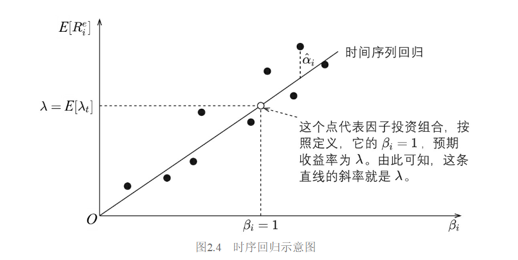

+++
title = '因子投资慢读计划'
date = 2024-08-28T00:25:16+08:00
tags = ['因子']
description = '每天读一点，不着急'
draft = false
math = true
+++

# 回归检验
## 时间序列回归

对某只股票 `$i$`

`$$
R_{it}^e=\alpha_i+\beta_i^T\lambda_t+\epsilon_t, \quad t=1,2,\cdots,T
$$`

时序回归：首先固定`$i$`，以这只股票在不同时间上的数据为样本，做OLS回归，得到属于这只股票的`$\beta_i^T,\alpha_i,\epsilon_i$`。OLS回归的步骤如下

$$
\mathbf{R}_i = \mathbf{X}_i \mathbf{b}_i + \boldsymbol{\epsilon}_i
$$
其中

`$$\mathbf{R}_i = \begin{pmatrix}
R_{i1}^e \\
R_{i2}^e \\
\vdots \\
R_{iT}^e\\
\end{pmatrix}_{T\times 1},
\mathbf{X}_i = \begin{pmatrix}
1 & \lambda_1^T \\
1 & \lambda_2^T \\
\vdots & \vdots \\
1 & \lambda_T^T
\end{pmatrix}_{T \times (k+1)},
\mathbf{b}_i = \begin{pmatrix}
\alpha_i \\
\beta_i
\end{pmatrix}_{(k+1) \times 1}, 
\boldsymbol{\epsilon}_i = \begin{pmatrix}
\epsilon_{i1} \\
\epsilon_{i2} \\
\vdots \\
\epsilon_{iT}
\end{pmatrix}_{T\times 1}
$$`

我们希望通过最小化误差平方和来估计 `$\mathbf{b}_i$`，即最小化以下目标函数：

`$$
S(\mathbf{b}_i) = \sum_{t=1}^T \epsilon_{it}^2 = \boldsymbol{\epsilon}_i^T \boldsymbol{\epsilon}_i
$$`

其中 `$\boldsymbol{\epsilon}_i = \mathbf{R}_i - \mathbf{X}_i \mathbf{b}_i$`，所以我们可以将目标函数写为：

`$$
S(\mathbf{b}_i) = (\mathbf{R}_i - \mathbf{X}_i \mathbf{b}_i)^2 = (\mathbf{R}_i - \mathbf{X}_i \mathbf{b}_i)^T (\mathbf{R}_i - \mathbf{X}_i \mathbf{b}_i)
$$`

展开后得到：

`$$
S(\mathbf{b}_i) = \mathbf{R}_i^T \mathbf{R}_i - 2\mathbf{b}_i^T \mathbf{X}_i^T \mathbf{R}_i + \mathbf{b}_i^T \mathbf{X}_i^T \mathbf{X}_i \mathbf{b}_i
$$`

为了找到最小值，我们需要对 `$S(\mathbf{b}_i)$` 关于 `$\mathbf{b}_i$` 求导并令其等于零：

`$$
\frac{\partial S(\mathbf{b}_i)}{\partial \mathbf{b}_i} = -2\mathbf{X}_i^T \mathbf{R}_i + 2\mathbf{X}_i^T \mathbf{X}_i \mathbf{b}_i = 0
$$`

简化后得到：

`$$
\mathbf{X}_i^T \mathbf{X}_i \mathbf{b}_i = \mathbf{X}_i^T \mathbf{R}_i
$$`

由于 `$\mathbf{X}_i^T \mathbf{X}_i$` 是可逆的（假设不存在多重共线性），我们可以得到：

`$$
\hat{\mathbf{b}}_i = (\mathbf{X}_i^T \mathbf{X}_i)^{-1} \mathbf{X}_i^T \mathbf{R}_i
$$`

`$\hat{\mathbf{b}}_i$` 是回归系数的估计值，包括 `$\hat{\alpha}_i$ 和 $\hat{\beta}_i$`：

`$$
\hat{\mathbf{b}}_i = \begin{pmatrix}
\hat{\alpha}_i \\
\hat{\beta}_i
\end{pmatrix}
$$`

误差项 `$\epsilon_{it}$` 的估计值可以通过以下公式得到：

`$$
\hat{\boldsymbol{\epsilon}}_i = \mathbf{R}_i - \mathbf{X}_i \hat{\mathbf{b}}_i
$$`

这是一张散点图，横轴是用时序回归估计出来的 `$\hat{\beta}_i$` ，纵轴是通过公式 `$E_t[R_{it}^e]=\hat{\alpha}_i+\hat{\beta}_iE_t[\lambda_t]$` 估计出来的预期收益率。因此，这张图不是最小化 `$\alpha_i$` 的结果。

既然我们已经估计出 `$\alpha_i$`，下面要检验其是否联合为零。常用的方法是GRS检验。

