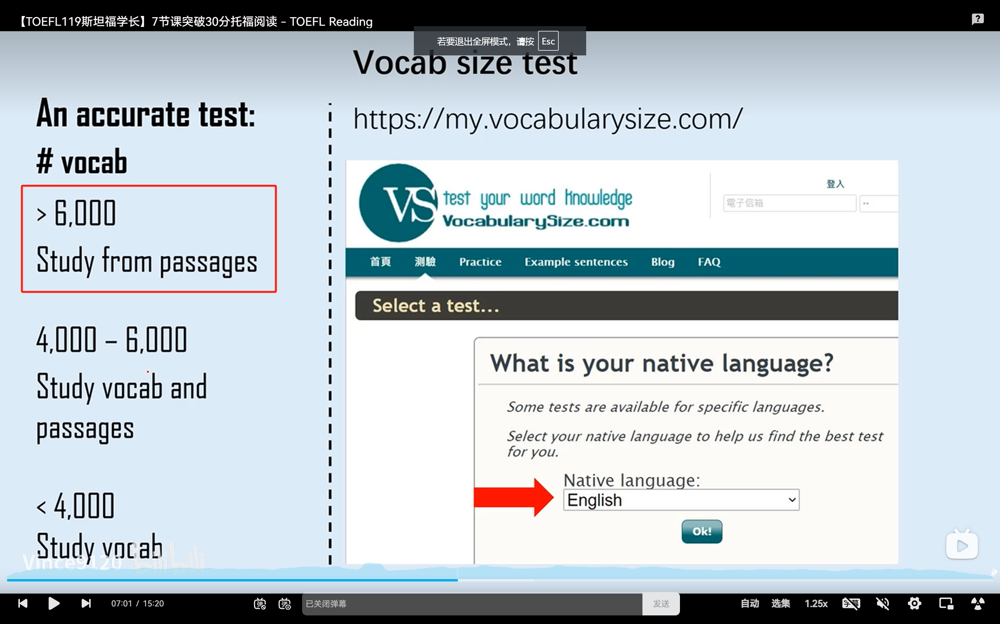
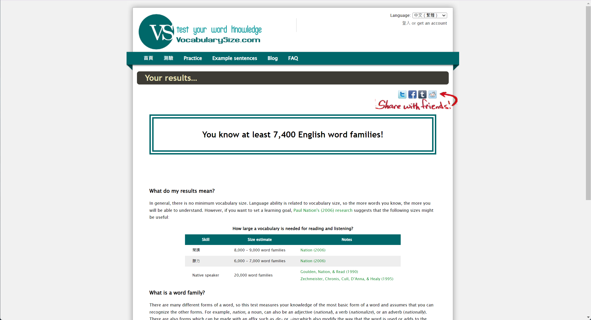

+++
title = 'TOEFL Reading'
date = 2024-08-28T23:42:22+08:00
description = 'Vince托福阅读课笔记'
tags = ['TOEFL']
draft = false
+++

# 如何备考

用循序渐进的方法，先攻阅读，然后是听力、口语、写作。因为考试题材不外乎

- Animals and plants
- Natural science
- Social science
- Humanities & Arts

听力和写作还有些其他的主题，但占比最大的就是以上四种，可以从阅读开始根据题材准备。

关于词汇量，不同阶段有不同的准备方法

于是我去测了，属于最高的阶段，可以直接从阅读中学单词、不用单独背单词书。

# 略读 Skimming

只看首尾两句 :x:, 而是看反复出现的实意词和同义替换 :ballot_box_with_check:

# 总结题怎么做

1. 提示词：题干下面的一行字，可以帮助确定文章重点
2. 排除，容易挖坑的地方：
   1. 因果关系 so, because

